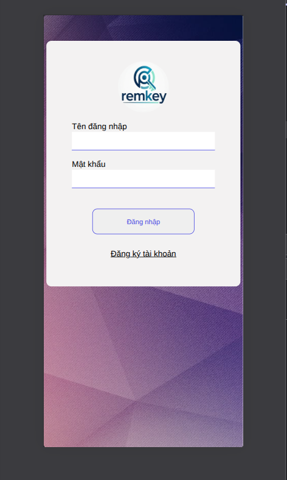
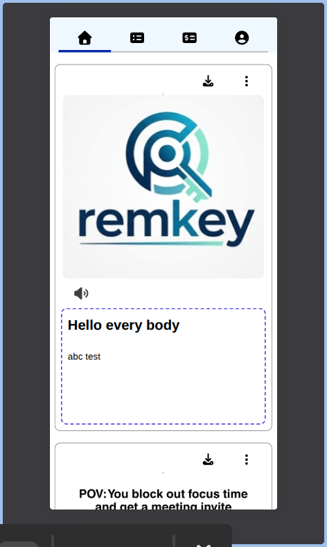
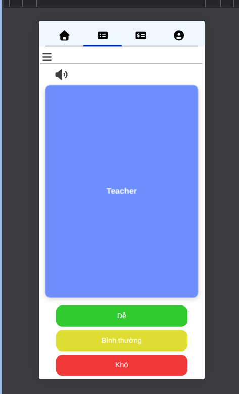

# REMKEY APPLICATION

## 1. Overview

Remkey is a specialized flashcard application designed to maximize long-term memory retention through an advanced Spaced Repetition System (SRS).

Unlike traditional applications that rely on outdated scheduling models, Remkey integrates the FSRS (Free Spaced Repetition Scheduler) algorithm. This modern mathematical model dynamically predicts your memory's "forgetting curve" and calculates the optimal time to review each card. By focusing on Stability (S), Difficulty (D), and Retrievability (R), Remkey ensures you spend less time reviewing what you already know and more time mastering new material.

What truly sets Remkey apart is its integrated social ecosystem. Beyond personal study, it features a built-in "mini social network" where you can discover, share, and import community-created flashcard decks directly into your own library—making knowledge-sharing seamless and free.

## Deploy demo
[remkey.site](https://remkey.site)

### Screenshot

 |
 |
 

## 2. Business document

- [Google driver](https://drive.google.com/drive/u/1/folders/1O5JeI9eR3FV54rDBGYc0tVMPpWb_tMcu)
    
## 3.Tech Stack

### Backend

- Java 21
- Spring Boot 3

### Database & Storage

- PostgreSQL
- Redis

### Frontend

- ReactJs

### Third party APIs/Services

- FireBase
- ResponsiveVoice
- Resend mail
- Cloudinary

### Security

- Jwt token
- Bucket4j
- OTP verify email

### Core algorithm

- FSRS (Free Spaced Repetition Scheduler): The core mathematical model for interval scheduling and memory optimization.

## 4. Installation & Setup

### Prerequisites

- [JDK 21 or higher](https://www.oracle.com/java/technologies/downloads/)

- [Maven 3.6+](https://maven.apache.org/install.html)

- [PostgreSQL 14+](https://www.postgresql.org/download/)

- [Firebase](https://firebase.google.com/)

- [Resend](https://resend.com/emails)

- [Cloudinary](https://cloudinary.com/)

- [Docker](https://docs.docker.com/engine/install/)

- [Nodejs](https://nodejs.org/en)

### Clone the Repository

 ```git clone https://github.com/lovankybb/remkey_application```

### Database Configuration

- At root directory run command: ```sudo docker compose up -d```

### Backend configuration

#### 1. Create file server/src/.env

```
#File: .env

DATASOURCE_URL=
DATASOURCE_USERNAME=
DATASOURCE_PASSWORD=


REDIS_URL=

#cloud
CLOUDINARY_CLOUD_NAME=
CLOUDINARY_SECRET_KEY=
FRONT_END_ADDRESS=


RESEND_API_KEY=


JWT_SECRETE_KEY=
JWT_VALID_DURATION=
JWT_REFRESHABLE=


VNPAY_TMN_CODE=
VNPAY_SECRETE_KEY=
VNPAY_PAY_URL=
VNPAY_RETURN_URL=
VNPAY_EXPIRE_TIME=


MOM0_PARTNER_CODE=
MOMO_ACCESS_KEY=
MOMO_SECRET_KEY=
MOMO_RETURN_URL=
MOMO_API_URL=
MOMO_NOTIFY_URL=


```

#### 2. Add file server/src/main/resources/firebase/your_firebase_secret_key.json

- Create a project at https://firebase.google.com/ .Get your_firebase_secret_key.json and put it at the correct location.

### Frontend

#### 1. Create file web-app/.env

```
#File: .env

VITE_API_BASE_URL=http://localhost:8080


#FireBase data
VITE_API_KEY=
VITE_AUTH_DOMAIN=
VITE_PROJECT_ID=
VITE_STORAGE_BUCKET=
VITE_MESSAGING_SENDER_ID=
VITE_APP_ID=
VITE_MEASUREMENT_ID=


```

#### 2. Create file web-app/public/firebase-messaging-sw.js

```
importScripts('https://www.gstatic.com/firebasejs/9.0.0/firebase-app-compat.js');
importScripts('https://www.gstatic.com/firebasejs/9.0.0/firebase-messaging-compat.js');

const firebaseConfig = {
  apiKey: your-api-key,
  projectId: your-project-id,
  messagingSenderId: your-messaging-id,
  appId: your-app-id,
};

firebase.initializeApp(firebaseConfig);
const messaging = firebase.messaging();

messaging.onBackgroundMessage((payload) => {
  console.log("[sw.js] Nhận thông báo trong background", payload);

  const notificationTitle = payload.notification.title || "Remkey Notification";
  const notificationOptions = {
    body: payload.notification.body || "Bạn có tin nhắn mới",
    icon: "/logo.png",
    badge: "/logo.png",
    data: { url: "/" }
  };

  return self.registration.showNotification(notificationTitle, notificationOptions);
});

self.addEventListener('notificationclick', (event) => {
  event.notification.close();
  event.waitUntil(
    clients.openWindow(event.notification.data.url)
  );
});
```

### Postman

  [View API collection](https://lovankydev.postman.co/workspace/lovankydev's-Workspace~053387a3-a707-44bc-8a9c-9cfdcdad1ce7/collection/46238050-1c1d4b70-bc20-45d4-84ce-d0fd5c5593db?action=share&source=copy-link&creator=46238050)

## Contact
- Author: Lo Van Ky
- Email: lovanky.work@gmail.com
- Phone: +8486535996
- Zalo: +84865305996
- Address: Haiphong , Vietnam.
